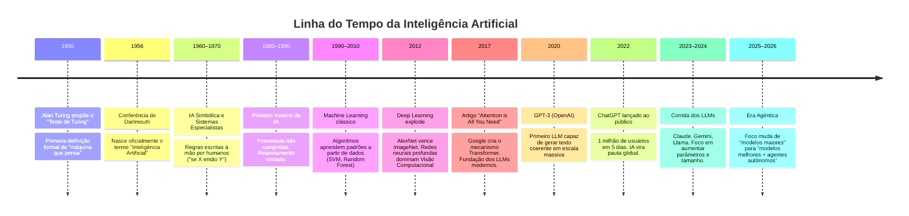
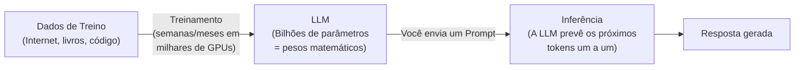
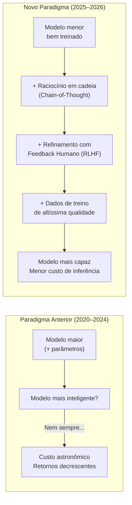
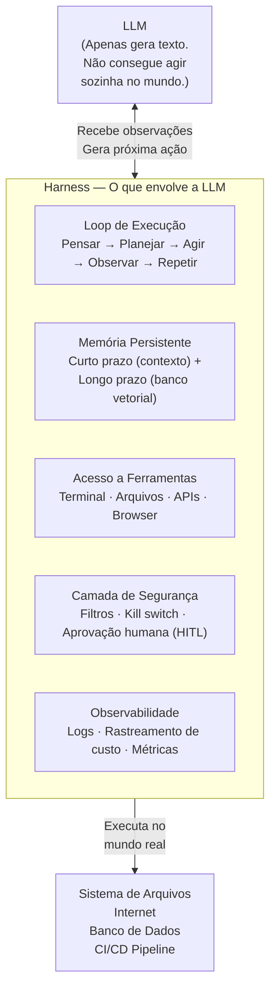
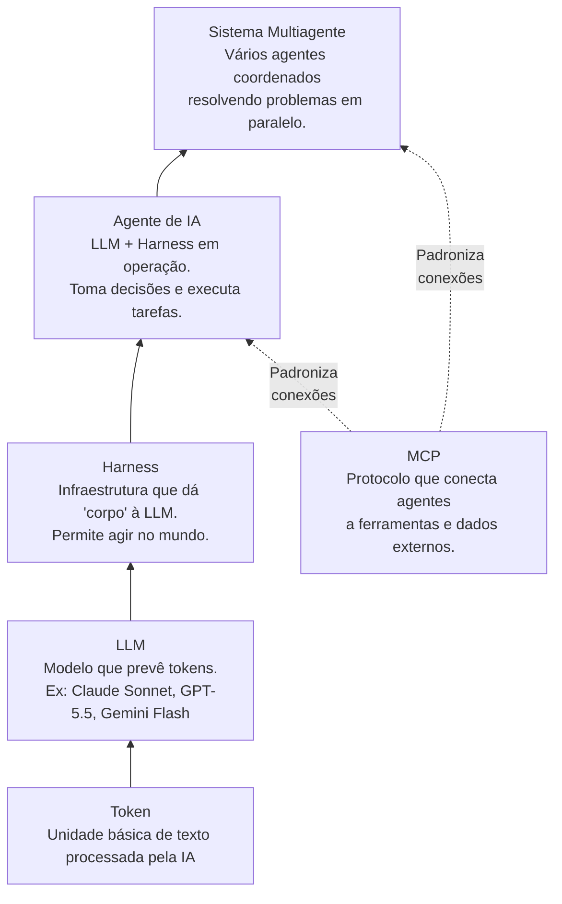
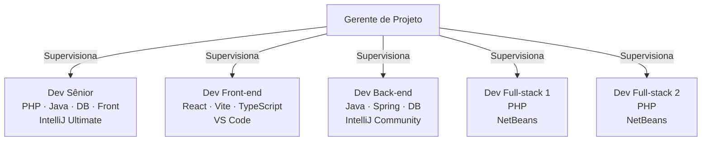
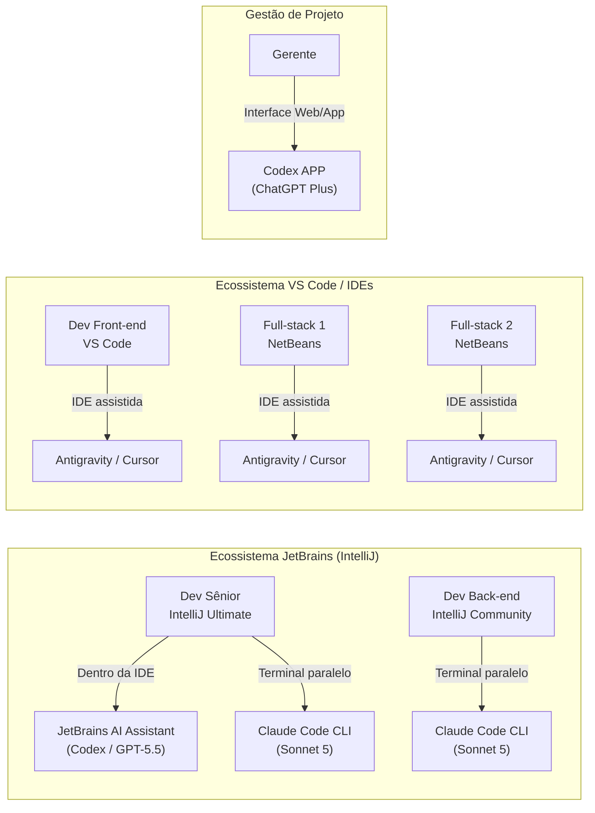

# Resultados da Pesquisa: Ferramentas Agênticas de IA para Desenvolvimento (Junho 2026 - Atualizado em 30 de Junho de 2026)

> Pesquisa realizada em 17 de Junho de 2026 e atualizada em 30 de Junho de 2026, com base no plano definido em `plano_de_pesquisa_ia_2026.md`.

---

## Parte 0 — Fundamentos de Inteligência Artificial

> Esta seção é o ponto de partida para a apresentação à equipe. Cobre a história, os conceitos essenciais e a evolução do campo de IA até o presente.

---

### 0.1 — Breve História da Inteligência Artificial

A IA não surgiu de um dia para o outro. É o resultado de décadas de avanços científicos, falhas e renascimentos:



#### Três fases que todo desenvolvedor precisa entender:

| Fase | Período | Como a IA "aprendia" | Exemplo |
|:---|:---|:---|:---|
| **IA Simbólica** | 1950–1980 | Regras escritas manualmente por especialistas | Sistema Especialista médico com 500 regras "se-então" |
| **Machine Learning** | 1980–2016 | Algoritmos extraem padrões de dados estruturados | Filtro de spam, recomendação do Netflix |
| **Deep Learning / LLMs** | 2017–hoje | Redes neurais com bilhões de parâmetros aprendem de texto bruto da internet | ChatGPT, Claude, Gemini |

---

### 0.2 — O Que é uma LLM?

**LLM** significa **Large Language Model** — Grande Modelo de Linguagem.

#### A analogia do autocomplete turbinado:

> Imagine o teclado do seu celular que sugere a próxima palavra enquanto você digita. Uma LLM faz exatamente isso — mas treinada em centenas de bilhões de palavras da internet, livros, artigos científicos e repositórios de código. O resultado é um sistema capaz de completar texto de forma tão coerente que parece ter compreensão real.

#### Como uma LLM funciona (simplificado):



#### Conceitos-chave para a equipe:

| Conceito | Definição simples | Impacto prático |
|:---|:---|:---|
| **Token** | Pedaço de palavra (~4 caracteres). "desenvolvedor" = ~3 tokens. | Limites de uso são medidos em tokens, não palavras. |
| **Prompt** | A instrução ou pergunta enviada à IA. | A qualidade do prompt define a qualidade da resposta. |
| **Parâmetros** | Os "pesos" internos do modelo — o que ele aprendeu. | Mais parâmetros ≠ modelo melhor (aprendemos isso em 2025). |
| **Janela de Contexto** | Quantidade de tokens que a IA "enxerga" de uma vez. | Quanto maior, mais código ela pode ler sem esquecer. |
| **Temperatura** | Controla o quão "criativa" ou "determinista" é a resposta. | Temperatura baixa = respostas mais precisas para código. |
| **Alucinação** | Quando a IA gera informação factualmente errada com confiança. | Crítico para código: sempre revise o output de uma LLM. |

---

### 0.3 — A Grande Virada de 2025: De "Modelos Maiores" para "Modelos Melhores"

Esta é uma das mudanças mais importantes para entender o cenário atual de 2026.

#### O paradigma anterior (2020–2024): **Escalar é tudo**

Durante anos, a receita para um modelo melhor era simples: **mais parâmetros + mais dados = modelo mais inteligente**. Essa lei, conhecida como *Scaling Laws*, guiou bilhões de dólares de investimento:

```
GPT-2 (2019): 1,5 bilhões de parâmetros
GPT-3 (2020): 175 bilhões de parâmetros ▲ 116x maior
GPT-4 (2023): ~1,8 trilhões de parâmetros ▲ ~10x maior
```

#### O problema: a lei começou a ter retornos decrescentes

A partir de 2024, ficou evidente que simplesmente aumentar o tamanho dos modelos não produzia mais os saltos de desempenho esperados. O custo de treinamento explodia (centenas de milhões de dólares por modelo), mas os ganhos em benchmarks reais eram marginais.

#### O novo paradigma (2025–2026): **Eficiência e Raciocínio**



#### As técnicas que substituíram o "escalar":

| Técnica | O que faz | Exemplo real |
|:---|:---|:---|
| **Chain-of-Thought (CoT)** | Ensina o modelo a "pensar em voz alta" antes de responder, resolvendo problemas passo a passo. | Claude Opus "pensa" por até 30s antes de responder questões complexas. |
| **RLHF** (Aprendizado por Reforço com Feedback Humano) | Avaliadores humanos classificam respostas; o modelo aprende com o ranking. | ChatGPT ficou muito mais útil com RLHF do GPT-3 para o 3.5. |
| **Destilação de Conhecimento** | Um modelo grande "ensina" um modelo menor, transferindo capacidade sem o tamanho. | Gemini 3.5 Flash é mais rápido que modelos 10x maiores em várias tarefas. |
| **Synthetic Data** | Usar modelos de IA para gerar dados de treino de alta qualidade para outros modelos. | Anthropic usou Claude para gerar dados de raciocínio matemático. |

> **Em resumo:** Em 2025, a indústria aprendeu que **um modelo menor, mais bem treinado e mais alinhado, supera um modelo gigante mal otimizado**. A corrida hoje não é de tamanho — é de qualidade do treinamento, eficiência de inferência e capacidade de raciocínio.

---

### 0.4 — O Que é um Harness (Suporte Agêntico)?

Se a LLM é o **cérebro**, o **Harness** é o **corpo e o sistema nervoso** que permite ao cérebro agir no mundo real.

#### A equação fundamental dos agentes:

$$\boxed{\text{Agente de IA} = \text{LLM (raciocínio)} + \text{Harness (ação)}}$$

#### O que o Harness fornece que a LLM não tem sozinha:



#### Scaffolding vs. Harness — qual é a diferença?

| | **Scaffolding** | **Harness** |
|:---|:---|:---|
| **O que é** | O esqueleto / template inicial do agente. | A infraestrutura completa de operação em produção. |
| **Quando atua** | Durante o desenvolvimento/setup. | Durante a execução em tempo real. |
| **Analogia** | A planta arquitetônica de uma casa. | A fiação elétrica, encanamento e estrutura que a tornam habitável. |
| **Exemplo** | O arquivo `CLAUDE.md` que define regras do projeto. | O loop de execução que re-tenta ações falhas e registra o custo. |

---

### 0.5 — Dicionário de Conceitos: LLM, Harness, Agente, MCP e Mais

#### Hierarquia dos conceitos (do mais simples ao mais complexo):



#### Definições detalhadas:

** LLM (Large Language Model)**
> O modelo de linguagem em si. É apenas uma função matemática que recebe tokens de entrada e prevê tokens de saída. Sozinha, não tem memória entre conversas, não acessa a internet, não executa código. É um "cérebro em um frasco".

** Harness (Suporte Agêntico)**
> Todo o código e infraestrutura ao redor da LLM que permite que ela aja no mundo real. Inclui o loop de execução (Pensar → Agir → Observar), gerenciamento de memória, acesso a ferramentas e mecanismos de segurança. *Sem o harness, a LLM é poderosa mas inerte.*

** Agente de IA**
> A combinação de LLM + Harness em funcionamento. Um agente recebe um **objetivo** (não apenas uma pergunta), planeja os passos para atingi-lo, executa ações, observa os resultados e itera até concluir. Ex: "Refatore toda a autenticação do projeto para usar JWT" — o agente lê os arquivos, faz as mudanças, roda os testes e só pára quando os testes passam.

** MCP (Model Context Protocol)**
> Protocolo aberto criado pela Anthropic e adotado pela indústria em 2024–2025. É o "USB-C dos agentes de IA": um padrão universal que permite que qualquer agente se conecte a qualquer ferramenta (GitHub, Jira, Slack, banco de dados, APIs) sem precisar de integrações customizadas para cada par. Antes do MCP, cada agente precisava de um conector específico para cada ferramenta. Com o MCP, qualquer ferramenta que publique um "servidor MCP" funciona com qualquer agente compatível.

** RAG (Retrieval-Augmented Generation)**
> Técnica que combina uma LLM com uma **base de conhecimento externa**. Em vez de depender apenas do que o modelo aprendeu durante o treinamento, o sistema busca documentos relevantes em tempo real (sua documentação interna, wiki, tickets do Jira) e os injeta no contexto antes de responder. Resultado: respostas mais precisas sobre dados específicos da empresa, sem re-treinar o modelo.

** Banco Vetorial (Vector Database)**
> Banco de dados especializado em armazenar e buscar informações por **similaridade semântica** (significado), não por palavras-chave exatas. É o "armazém de memória de longo prazo" dos agentes. Exemplos: Pinecone, Chroma, pgvector. Usado em conjunto com RAG.

** Chain-of-Thought (CoT)**
> Técnica de prompting que instrui a LLM a escrever seu raciocínio intermediário antes de dar a resposta final ("pense passo a passo"). Melhora dramaticamente a precisão em tarefas de lógica, matemática e programação.

** Sistema Multiagente (MAS)**
> Arquitetura onde vários agentes especializados colaboram para resolver um problema maior. Ex: um agente de planejamento define o que fazer, um agente de código implementa, um agente de QA testa, um agente de revisão valida a segurança — tudo em paralelo.

** HITL (Human-in-the-Loop)**
> Padrão de segurança onde o agente pausa em ações de alto risco e aguarda aprovação humana antes de prosseguir. Ex: o Claude Code pede confirmação antes de deletar arquivos ou executar scripts de banco de dados.

** Prompt Engineering**
> A arte e a ciência de escrever instruções (prompts) eficazes para extrair o máximo de uma LLM. Em 2026, evoluiu para **Agent Engineering**: a habilidade de arquitetar sistemas de agentes, não apenas escrever perguntas.

---

## Parte A — Modelos de IA de Fronteira (Junho 2026)


### OpenAI
| Modelo | Status | Observações |
| :--- | :--- | :--- |
| **GPT-5.6 Sol** | Futuro (Roadmap) | Próximo flagship com foco em raciocínio matemático avançado e lógica. |
| **GPT-5.6 Terra** | Futuro (Roadmap) | Foco em otimização para agentes de CLI e geração de código autônoma. |
| **GPT-5.6 Luna** | Futuro (Roadmap) | Modelo leve de ultra-baixa latência projetado para autocomplete e pequenas refatorações inline. |
| **GPT-5.5** | Ativo (Flagship) | Modelo principal para Codex e ChatGPT. Razão e código de alto nível. |
| GPT-5.2 (Instant/Thinking/Pro) | Aposentado em 12/Jun/2026 | Conversas migradas automaticamente para GPT-5.5. |
| GPT-4.5 | Aposentado em 27/Jun/2026 | Substituído por completo pelo ecossistema GPT-5.5. |
| o3 | Aposentadoria em 26/Ago/2026 | Modelo de raciocínio legado. |

### Anthropic (Claude)
| Modelo | Status | Observações |
| :--- | :--- | :--- |
| **Claude Fable 5** | Lançado em 09/Jun, acesso temporariamente suspenso em 12/Jun | O mais capaz da Anthropic. Saiu do ar para correções. |
| Claude Mythos 5 | Acesso limitado (Projeto Glasswing) | Sem filtros de segurança; apenas para clientes aprovados. |
| **Claude Sonnet 5** | Ativo (GA desde 30/Jun/2026) | Lançado hoje, 30 de Junho de 2026. Introduz "raciocínio adaptativo" (adaptive thinking) nativo e 1M de tokens de contexto. Altamente recomendado para tarefas agênticas rápidas. |
| **Claude Opus 4.8** | Ativo (GA) | Flagship estável para raciocínio profundo e codificação agêntica. |
| Claude Sonnet 4.6 | Legado | Substituído hoje pelo Claude Sonnet 5 para tarefas de desenvolvimento diárias. |
| **Claude Haiku 4.5** | Ativo (GA) | Velocidade máxima, tarefas simples e alto volume. |

### Google (Gemini)
| Modelo | Status | Observações |
| :--- | :--- | :--- |
| **Gemini 3.5 Flash** | Ativo (GA desde 19/Mai/2026) | Modelo padrão do Antigravity e do app Gemini. SOTA em velocidade e custo. Até 1M tokens (1.048.576 tokens) de contexto de entrada. |
| **Gemini 3.5 Pro** | Preview limitado (Vertex AI) | Flagship de raciocínio premium. Lançamento geral adiado para Julho de 2026 para refinamentos adicionais. |
| Gemini 3.1 Flash / Pro | Ativo (Estável) | Modelos de produção amplamente usados. |
| Gemma 4 (12B) | Lançado em Junho 2026 | Modelo open-source leve. |

---

## Parte B — As 3 Ferramentas Principais: Detalhamento Completo

---

### 1. Antigravity (Google DeepMind)

#### Interfaces Disponíveis

| Interface | Descrição | Características Únicas |
| :--- | :--- | :--- |
| **CLI** | Ferramenta de terminal escrita em Go. Substituiu a Gemini CLI (descontinuada em 18/Jun/2026). | Alta velocidade, workflows assíncronos em background, ideal para automação e scripts de CI/CD. |
| **APP** (Antigravity 2.0) | Aplicativo desktop standalone ("centro de comando"). | Orquestração de múltiplos agentes em paralelo, tarefas agendadas em background, integração nativa com Google AI Studio, Android e Firebase. |
| **IDE** | Editor de código estilo VS Code com sidebars de agente integradas. | Tab autocomplete contextual, painéis de agente (Editor vs. Manager Surface), edição inline assistida por IA. |

#### Modelos Suportados
* **Modelo Principal:** Gemini 3.5 Flash (SOTA, até **1 milhão de tokens** de contexto).
* **Flexibilidade:** Suporta modelos Claude e GPT via configuração de chaves de API externas.
* **Harness Compartilhado:** Todas as 3 interfaces (CLI, APP, IDE) compartilham o mesmo *agent harness* otimizado e o mesmo sistema de rastreamento de uso de tokens.

#### Limites de Uso
* Os limites de tokens são **compartilhados** entre as 3 interfaces (CLI, APP e IDE).
* O consumo depende do plano de API configurado (Google AI Studio gratuito ou Vertex AI pago).
* **Diferencial:** A janela de contexto de 1M tokens do Gemini 3.5 Flash permite ingerir repositórios inteiros de código.

#### Funcionalidades Exclusivas
* **Subagentes Dinâmicos:** Pode criar e gerenciar agentes especializados que rodam em paralelo.
* **Artefatos Verificáveis:** Gera planos de implementação, listas de tarefas e diffs de código como "Artifacts" para revisão humana.
* **Science Skills:** Habilidades curadas para consultar bancos de dados científicos (AlphaGenome, AFDB, UniProt).
* **SDK Python:** Framework programático para desenvolvedores criarem agentes personalizados com hooks de ciclo de vida.

---

### 2. Codex (OpenAI)

#### Interfaces Disponíveis

| Interface | Descrição | Características Únicas |
| :--- | :--- | :--- |
| **CLI** | Ferramenta de linha de comando. | Inicia tarefas e transfere para o APP para supervisão visual. Integração com pipelines CI/CD. |
| **APP** (Desktop + Web) | Aplicativo nativo para macOS e Windows + interface web (chatgpt.com/codex). | Recurso "Codex Sites" para criar e deployar web apps direto da interface. Gerenciamento de metas (Goals). |

> **Nota:** Codex também está disponível via extensões para VS Code e JetBrains, mas estas funcionam como extensões de IDE de terceiros, não como uma IDE proprietária do ecossistema.

#### Modelos Suportados
* **Modelo Principal:** GPT-5.5.
* Modelos mais antigos (GPT-5.2, GPT-5.3-Codex) foram aposentados da interface ChatGPT, mas podem estar disponíveis via API direta.
* Suporte a diferentes níveis de "esforço de raciocínio" (*reasoning effort*): normal, high, xhigh — impactando desempenho e consumo.

#### Limites de Uso
* **Janela rolante de 5 horas:** O uso é medido em tokens consumidos dentro de uma janela de 5 horas. Ao atingir o limite, é necessário aguardar o reset.
* **Problemas de capacidade:** Em horários de pico, o GPT-5.5 apresenta erros de "Model at capacity", especialmente com configurações "xhigh effort".
* **Consumo estimado:** Usuários avançados estimam gastar entre **$100–$200/mês** em uso real.

#### Funcionalidades Exclusivas
* **Codex Sites:** Deploy de aplicações web diretamente do ambiente agêntico (preview).
* **Goal Management:** Definição de metas de alto nível que o agente persegue ao longo de múltiplas sessões.
* **Cross-Surface:** Pode iniciar uma tarefa na CLI e acompanhar o progresso no APP desktop.

---

### 3. Claude Code (Anthropic)

#### Interfaces Disponíveis

| Interface | Descrição | Características Únicas |
| :--- | :--- | :--- |
| **CLI** | Agente de terminal instalado via npm (`npm install -g @anthropic-ai/claude-code`). | Executa comandos shell, edita arquivos, gerencia git workflows. Modos de permissão (safe → autonomous). |
| **APP** (Desktop) | Aplicativo desktop dedicado. | Interface visual para gerenciamento de sessões de código, visualização de artefatos e revisão de alterações. |

#### Modelos Suportados
* **Opus 4.8:** Raciocínio profundo, decisões arquiteturais, refatorações complexas.
* **Sonnet 4.6:** Equilíbrio custo-desempenho para codificação diária (modelo padrão).
* **Haiku 4.5:** Velocidade máxima para tarefas simples e alto volume.
* **Claude Fable 5:** O mais capaz (quando disponível), com janela de até **1M tokens de contexto**.
* O usuário pode trocar de modelo a qualquer momento via comandos `/model` no CLI.

#### Limites de Uso
* **Janela rolante de 5 horas + cap semanal:** Sistema de duas camadas que impede o esgotamento total do uso.
* **Cota compartilhada:** O uso no CLI consome a **mesma cota** do Claude.ai (web) e do Claude Desktop.
* **Mudança crítica (15/Jun/2026):** Uso automatizado "headless" (Agent SDK, GitHub Actions, CI/CD) foi movido para um sistema de créditos separado em dólares, desacoplando-o da cota da assinatura.
* **Autenticação:** Se configurar via `ANTHROPIC_API_KEY`, a cobrança vai para a conta de API (pay-per-token), **não** para a assinatura Pro/Max.

#### Funcionalidades Exclusivas
* **CLAUDE.md:** Arquivo de regras específicas por repositório que personaliza o comportamento do agente.
* **Hooks Automatizados:** Scripts que disparam antes/depois de ações do agente.
* **Model Context Protocol (MCP):** Integração nativa com GitHub, Jira, Slack e milhares de apps.
* **Modos de Permissão:** De "safe" (pede aprovação para tudo) até "autonomous" (executa sem interrupção).
* **Planning Mode:** Para tarefas complexas, o agente cria um plano de implementação detalhado antes de agir.

---

## Parte C — Comparativo de Preços e Planos (Junho 2026)

### Planos de Assinatura (Acesso Geral ao Modelo + Agente)

| Ferramenta / Provedor | Gratuito | Entrada (~$20/mês) | Intermediário (~$100/mês) | Power User (~$200/mês) |
| :--- | :--- | :--- | :--- | :--- |
| **Antigravity** (Google) | Uso gratuito de API com limites | AI Pro: $20/mês | AI Ultra: $100/mês (5x cota) | AI Ultra Max: $200/mês (20x cota) |
| **Codex** (OpenAI) | Acesso limitado | ChatGPT Plus: $20/mês | ChatGPT Pro: $100/mês (5x cota) | ChatGPT Pro: $200/mês (20x cota) |
| **Claude Code** (Anthropic) | Limitado (sem acesso ao Claude Code) | Claude Pro: $20/mês ($17 anual) | Claude Max 5x: $100/mês | Claude Max 20x: $200/mês |

### Planos de Concorrentes (Contexto Comparativo)

| Ferramenta | Entrada | Intermediário / Teams | Modelo de Cobrança |
| :--- | :--- | :--- | :--- |
| **Cursor** | Pro: $20/mês | Pro+: $60/mês, Ultra: $200/mês | Créditos mensais (modelos diferentes consomem taxas diferentes). |
| **Windsurf** | Pro: $20/mês | Teams: Sob consulta / Custom | Créditos mensais integrados no editor. Foco no Cascade Agent. |
| **GitHub Copilot** | **Novas assinaturas pausadas desde 20/Abr/2026.** Sem previsão de reabertura. | Pro+: $39/mês (apenas assinantes existentes) | Sistema de "AI Credits" desde 01/Jun/2026. Problemas generalizados de billing e downgrade involuntário de contas. |

---

## Parte D — Comparativo Geral: Antigravity vs. Claude Code vs. Codex vs. Cursor vs. Windsurf

| Critério | Antigravity | Claude Code | Codex | Cursor | Windsurf |
| :--- | :--- | :--- | :--- | :--- | :--- |
| **Interfaces** | CLI + APP + IDE | CLI + APP | CLI + APP | IDE (VS Code fork) | IDE (VS Code fork) |
| **Modelos** | Gemini (nativo) + Claude + GPT via API | Claude Opus/Sonnet/Haiku/Fable/Sonnet 5 | GPT-5.5 | Multi-model (Claude, GPT, Gemini) | Multi-model (Claude, GPT, Gemini) |
| **Contexto Máx.** | **1M tokens** (Gemini 3.5 Flash) | **1M tokens** (Fable 5 / Sonnet 5) | ~200K tokens (GPT-5.5) | Depende do modelo escolhido | Depende do modelo escolhido (até 1M) |
| **Orquestração Multi-Agente** | Nativa (subagentes dinâmicos) | Limitada (subagentes via SDK) | Básica (Goal Management) | Não nativa | Sim (Cascade Agent flow) |
| **Melhor Para** | Equipes iniciando jornada agêntica; projetos grandes | Devs seniores que vivem no terminal; DevOps | Generalistas; prototipagem web rápida | Devs solo que querem controle manual fino | Devs buscando fluxo de agente autônomo na IDE |
| **Entrada** | $20/mês | $20/mês | $20/mês | $20/mês | $20/mês |
| **Power User** | $200/mês | $200/mês | $200/mês | $200/mês | Sob consulta / Custom |
| **Estabilidade (Jun/2026)** | Estável | Fable 5 temporariamente suspenso | Erros de capacidade em pico | Estável | Estável |

---

## Parte E — Recomendação Personalizada por Perfil da Equipe

> Análise baseada no contexto real da equipe: 5 desenvolvedores + 1 gerente de projeto, considerando a IDE atual de cada um.

### Visão Geral da Equipe



---

### Gerente de Projeto

| Aspecto | Recomendação |
| :--- | :--- |
| **Ferramenta principal** | **Codex APP** (ChatGPT) ou **Antigravity APP** |
| **Por quê** | Não programa diretamente. Precisa de uma interface visual, sem terminal, para gerar documentação, redigir user stories, acompanhar relatórios de progresso e criar resumos de código para stakeholders não técnicos. |
| **Uso agêntico** | Delegar para o Codex a geração de relatórios de sprint, diagramas de arquitetura em linguagem natural e resumos executivos do estado do projeto. |
| **Plano sugerido** | ChatGPT Plus ($20/mês) ou Google AI Pro ($19.99/mês) — interface web/app é suficiente. |
| ** Evitar** | CLIs (Claude Code, Antigravity CLI). Não há benefício prático sem ambiente de desenvolvimento. |

---

### Dev Sênior (PHP · Java · Banco de Dados · Front-end) — IntelliJ IDEA Ultimate

**Contexto:** É o desenvolvedor com maior amplitude de linguagens e a IDE mais poderosa do time. O IntelliJ Ultimate tem suporte oficial ao **JetBrains AI Assistant**, que integra o Codex (GPT-5.5) nativamente desde a versão 2025.3.

| Aspecto | Recomendação |
| :--- | :--- |
| **Principal (dentro da IDE)** | **JetBrains AI Assistant** com integração ao **Codex (GPT-5.5)** |
| **Complemento agêntico** | **Claude Code CLI** (terminal paralelo ao IntelliJ) |
| **Por quê** | O JetBrains AI Assistant fornece autocomplete contextual, refatoração inline e chat dentro do IntelliJ — sem trocar de ambiente. Para tarefas agênticas complexas (ex: refatorar um módulo inteiro de PHP, migrar queries SQL, analisar toda a base Java), o Claude Code CLI no terminal é o mais poderoso do mercado para raciocínio profundo. |
| **Fluxo recomendado** | IDE: JetBrains AI Assistant para codificação assistida diária → Terminal: Claude Code CLI (Opus 4.8) para delegação de tarefas de longa duração. |
| **Modelo sugerido no CLI** | Claude Opus 4.8 (raciocínio arquitetural) ou Claude Sonnet 5 (raciocínio adaptativo e velocidade). |
| **Plano sugerido** | Claude Max 5x ($100/mês) — o volume e a variedade de linguagens deste perfil esgota o plano Pro rapidamente. |
| ** Limitação** | Antigravity IDE ou Windsurf exigiriam trocar o IntelliJ pelo fork do VS Code — custo de transição alto para o perfil mais sênior. |

---

### Dev Front-end (React · Vite · TypeScript) — VS Code

**Contexto:** VS Code é o ambiente nativo dos grandes agentes de IDE. Este desenvolvedor tem a melhor posição da equipe para adotar as ferramentas mais modernas com zero atrito.

| Aspecto | Recomendação |
| :--- | :--- |
| **Principal (dentro da IDE)** | **Antigravity IDE (ou Cursor Pro) [Preferencial]** |
| **Por quê** | Familiaridade com a IDE. A transição do VS Code para a Antigravity IDE ou Cursor Pro é imediata, mantendo atalhos, temas e extensões, além de fornecer autocomplete inteligente e agentes de contexto com janela de 1M de tokens do Gemini 3.5 Flash ou Claude Sonnet 5. |
| **Fluxo recomendado** | Usar a Antigravity IDE ou Cursor Pro para autocomplete e delegação de criação de componentes e testes unitários. |
| **Modelo sugerido** | Gemini 3.5 Flash ou Claude Sonnet 5. |
| **Plano sugerido** | Plano Pro ($20/mês). |

---

### Dev Back-end (Java · Spring · Banco de Dados) — IntelliJ IDEA Community Edition

**Contexto:** IntelliJ Community não inclui o JetBrains AI Assistant nativamente (disponível apenas no Ultimate). O caminho de menor atrito é diferente do sênior.

| Aspecto | Recomendação |
| :--- | :--- |
| **Principal (dentro da IDE)** | Plugin de comunidade **"Claude Code Plus"** ou **"CC GUI"** (JetBrains Marketplace) |
| **Complemento agêntico** | **Claude Code CLI** (terminal paralelo ao IntelliJ Community) |
| **Por quê** | Os plugins de comunidade instalam uma GUI para o Claude Code diretamente no IntelliJ Community, fornecendo chat com streaming, visualização de diffs e edição contextual — sem precisar pagar pelo Ultimate. Para refatorações de Spring (ex: migração de versão de Spring Boot, geração de testes de integração com JUnit 5, queries JPQL/SQL), o Claude Code CLI com o modelo Sonnet 5 é extremamente eficaz. |
| **Fluxo recomendado** | Plugin IntelliJ para assistência inline → Claude Code CLI para delegação agêntica de tarefas maiores (ex: "refatore todos os repositories para usar o padrão Repository + Specification"). |
| **Modelo sugerido** | Claude Sonnet 5 (excelente custo-benefício para Java/Spring no dia a dia). |
| **Plano sugerido** | Claude Pro ($20/mês) — suficiente para back-end com tarefas bem delimitadas. |

---

### Dev Full-stack 1 e 2 (PHP) — NetBeans

**Contexto:** O NetBeans é a IDE com menor suporte nativo de IA do mercado em 2026. Para garantir a adoção das melhores ferramentas da equipe com o menor atrito, a melhor abordagem é a transição de ambiente.

| Aspecto | Recomendação |
| :--- | :--- |
| **Principal (dentro da IDE)** | **Antigravity IDE (ou Cursor Pro) [Preferencial]** |
| **Alternativa Híbrida** | **Claude Code CLI** em terminal paralelo ao NetBeans (se desejarem manter o NetBeans temporariamente) |
| **Por quê** | Familiaridade com a IDE. A migração do NetBeans para a Antigravity IDE ou Cursor Pro provê autocomplete em tempo real, chat integrado e agentes de refatoração dinâmicos em uma interface VS Code moderna, ideal para a stack PHP/Web, com cota de 1M de tokens do Gemini 3.5 Flash ou Claude Sonnet 5. |
| **Fluxo recomendado** | Desenvolver na Antigravity IDE / Cursor usando o autocomplete agêntico e delegar tarefas complexas aos subagentes integrados. |
| **Modelo sugerido** | Claude Sonnet 5 ou Gemini 3.5 Flash. |
| **Plano sugerido** | Plano Pro ($20/mês por dev). |

---

### Resumo Executivo: Recomendação por Membro

| Membro | IDE Atual | Solução Recomendada | Plano | Custo Mensal Est. |
| :--- | :--- | :--- | :--- | :--- |
| **Gerente de Projeto** | — | Codex APP (ChatGPT Plus) | Plus | ~$20/mês |
| **Dev Sênior** | IntelliJ Ultimate | JetBrains AI + Claude Code CLI | Pro | ~$20/mês |
| **Dev Front-end** | VS Code | Antigravity IDE / Cursor | Pro | ~$20/mês |
| **Dev Back-end** | IntelliJ Community | Claude Code CLI | Pro | ~$20/mês |
| **Dev Full-stack 1** | NetBeans | Antigravity IDE / Cursor | Pro | ~$20/mês |
| **Dev Full-stack 2** | NetBeans | Antigravity IDE / Cursor | Pro | ~$20/mês |
| **TOTAL ESTIMADO** | | | | **~$120/mês** |

> **Nota:** O custo total de ~$120/mês cobre toda a equipe com ferramentas de nível profissional de forma homogênea.

---

### Mapa de Ferramentas por Desenvolvedor


